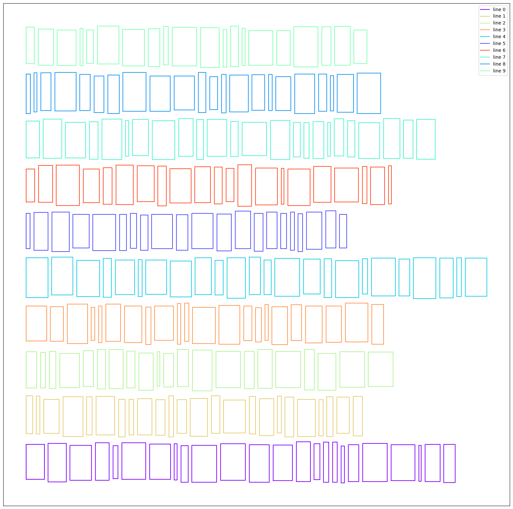
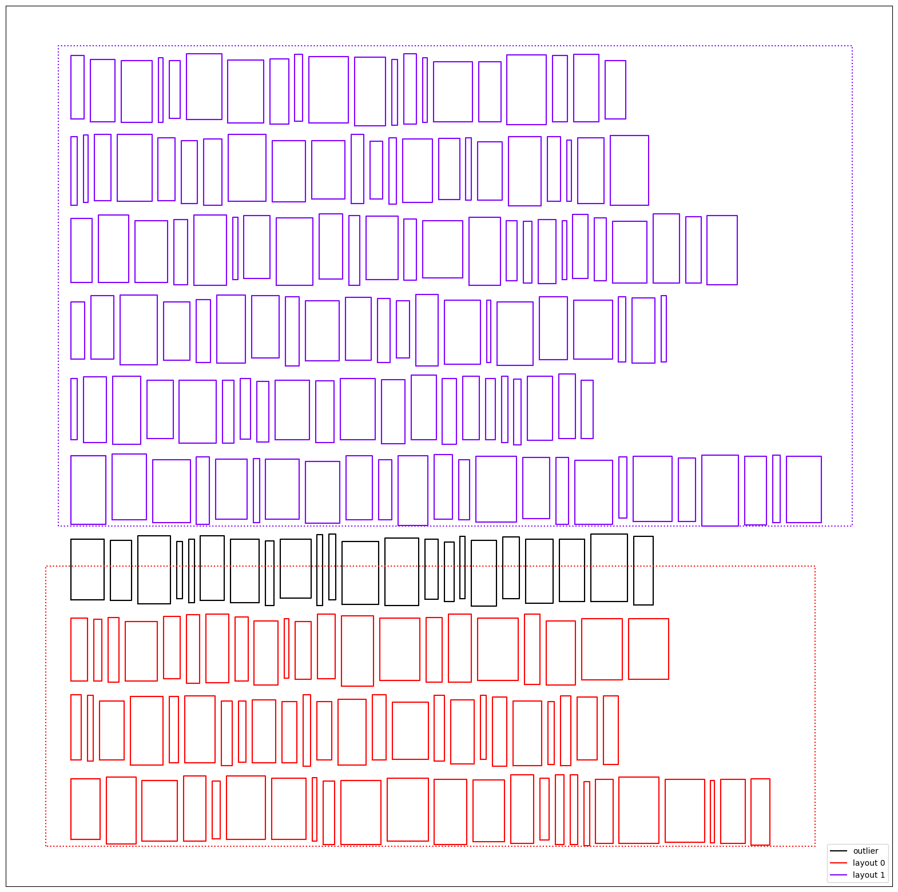

boxly is a geometric library for (hyper-) bounding boxes, created to support cross-referencing of bounding boxes created by various detection algorithms. It's somewhat similar to [`shapely`](https://shapely.readthedocs.io/en/stable/), but nowhere near as feature rich. Moreover, it operates on sets of boxes, rather than one shape, for efficiency.

For example, considering only the vertical dimension of the bounding boxes of detected characters, e.g. via OCR, the IoU matrix could help grouping them into lines with a clustering algorithm like DBSCAN.

Or consider assigning detected OCR characters to larger layout detections, like tables, figure captions, from a different model.

# Installation

```bash
pip3 install boxly
```

# Representation

For efficiency, the functions operate on sets of bounding boxes, defined by a `np.ndarray` of shape $n_{boxes} \times 2 \times n_{dimenions}$

Usually $n_{dimenions}=2$ for bounding boxes of images, or in the specific aforementioned case of grouping towards lines, $n_{dimenions}=1$.

The second dimension of the array, of size 2, represents the lower and upper values of the box.

# Usage

## `intersection(boxes0, boxes1)`

Returns a matrix of `len(boxes0)` $\times$ `len(boxes1)` of the pairwise areas of the intersection of box0 and box1, or 0 if there is no overlap.

## `area(boxes)`

Returns an array of `len(boxes)` with the area (or length, volume, etc) of each box.

## `iou(boxes0, boxes1)`

Returns a matrix of `len(boxes0)` $\times$ `len(boxes1)` of the pairwise areas of the IoU (intersection over union) of box0 and box1, or 0 if there is no overlap. Values are in $[0, 1]$.

## `inclusion(boxes0, boxes1)`

Returns a matrix of `len(boxes0)` $\times$ `len(boxes1)` of the pairwise areas of the percentage of box0 is included in box1, or 0 if there is no overlap. Values are in $[0, 1]$.


# Examples

## Example use to cluster lines

```python3
import numpy as np
from sklearn.cluster import DBSCAN
import matplotlib.pyplot as plt
from boxly.ops import iou, inclusion

# Create 10 random bounding boxes that follow (i.e. via the cumsum) each other
# on a line, to simulate the result of an OCR
n_lines=10

detected_characters = np.array([
    [[x0+5, line+5 + y_], [x1+5, line+0.8+5+y__]]
    for line, line_length in enumerate(20 + np.random.randint(0, 5, n_lines))
    for coords in [np.cumsum(np.concatenate([[0], 0.8 + 3*np.random.rand(line_length)]))]
    for x0, x1, y_, y__ in zip(
      coords, coords[1:]-0.5,
      0.1 * np.random.rand(line_length),
      0.1 * np.random.rand(line_length)
    )
])

# Calculate the vertical IoU, e.g. these are (percentages of) lengths over the
# vertical axis.
# `1 -` to transform the similarity into a distances, as required per DBSCAN.
vertical_iou_distance = 1 - iou(
    detected_characters[..., 1:],
    detected_characters[..., 1:])

# Cluster into lines using DBSCAN and the IoU
lines = DBSCAN(
  eps=0.2, min_samples=3, metric='precomputed'
).fit(vertical_iou_distance).labels_

# Create a random color for each line
line_colors = plt.get_cmap('rainbow')(np.linspace(0, 1, lines.max()+2))
np.random.shuffle(line_colors)
line_colors[0, :] = 0 # black for outliers, they could exist if eps is to low
                      # or min_samples too high.

# Transform into polygons and plot
polygons = detected_characters.reshape(-1, 4)[:, [[0, 1], [0, 3], [2, 3], [2, 1], [0, 1]]].transpose(2,1,0)
for line, line_color in enumerate(line_colors, start=-1):
  line_polygons = polygons[:, :, lines == line]
  if line_polygons.shape[2] > 0:
    plt.plot(*line_polygons,color=line_color)
    # pull one out, otherwise the legend overflows
    plt.plot(*line_polygons[..., 0], color=line_color, label=f'line {line}' if line >= 0 else 'outlier')
plt.legend()
```




## Example use to cluster lines

Continues with previous example

```python3
# Two detected layout boxes (manually crafted for the example)
layout_items = np.array([
    [[3, 5], [65, 8.5]],
    [[4, 9], [68, 15]]
])
layout_item_polygons = layout_items.reshape(-1, 4)[:, [[0, 1], [0, 3], [2, 3], [2, 1], [0, 1]]].transpose(2,1,0)

# how much of each character fits into both?
included_in_layout = inclusion(detected_characters, layout_items)

# pick the layout box with the largest inclusion
layout_assignment = included_in_layout.argmax(1)

# make outlier of less than 75% is included
threshold = 0.75
layout_assignment[included_in_layout.max(1) < threshold] = -1

# Create a random color for each line
layout_colors = plt.get_cmap('rainbow')(np.linspace(0, 1, len(layout_items)+1))
np.random.shuffle(layout_colors)
layout_colors[0, :3] = 0 # black for outliers, they could exist if eps is to low
                         # or min_samples too high.


plt.figure(figsize=(20, 20))
plt.xticks([]); plt.yticks([])

for layout, layout_color in enumerate(layout_colors, start=-1):
  if layout >= 0:
    plt.plot(*layout_item_polygons[..., layout], ':', color=layout_color)

  layout_polygons = polygons[:, :, layout_assignment == layout]
  if layout_polygons.shape[2] > 0:
    plt.plot(*layout_polygons, color=layout_color)
    # pull one out, otherwise the legend overflows
    plt.plot(*layout_polygons[..., 0], color=layout_color, label=f'layout {layout}' if layout >= 0 else 'outlier')
plt.legend()
```




